# 🎬 Media Embedding Test

This page tests various media embedding capabilities in Quartz!

## 📸 Local Image Test

Here's the image you added to attachments:


## 🌐 External Image Test

Here's the image from the URL you provided:


## 🎥 YouTube Video Embedding

Yes! Quartz can embed YouTube videos. Here are a few ways:

### Method 1: Direct YouTube URL
Just paste a YouTube URL and Quartz will auto-embed it:

https://www.youtube.com/watch?v=dQw4w9WgXcQ

### Method 2: YouTube Embed Code
You can also use HTML embed codes:

<iframe width="560" height="315" src="https://www.youtube.com/embed/dQw4w9WgXcQ" title="YouTube video player" frameborder="0" allow="accelerometer; autoplay; clipboard-write; encrypted-media; gyroscope; picture-in-picture" allowfullscreen></iframe>

## 🔗 Other Embeddable Content

### Twitter/X Tweets
```html
<blockquote class="twitter-tweet"><p lang="en" dir="ltr">Just setting up my twttr</p>&mdash; jack (@jack) <a href="https://twitter.com/jack/status/20">March 21, 2006</a></blockquote>
<script async src="https://platform.twitter.com/widgets.js" charset="utf-8"></script>
```

### CodePen
<iframe height="300" style="width: 100%;" scrolling="no" title="CSS Animation" src="https://codepen.io/team/codepen/embed/PNaGbb?height=300&theme-id=dark&default-tab=result" frameborder="no" loading="lazy" allowtransparency="true" allowfullscreen="true"></iframe>

### Spotify Playlists
<iframe src="https://open.spotify.com/embed/playlist/37i9dQZF1DX0XUsuxWHRQd" width="100%" height="380" frameborder="0" allowtransparency="true" allow="encrypted-media"></iframe>

## 📊 Interactive Content

### Mermaid Diagrams
Quartz supports Mermaid diagrams:

```mermaid
graph TD
    A[Start] --> B{Is it working?}
    B -->|Yes| C[Great!]
    B -->|No| D[Debug]
    D --> B
    C --> E[Ship it! 🚀]
```



### Math Equations (LaTeX)
Quartz supports LaTeX math:

Inline math: $E = mc^2$

Block math:
$$\int_{-\infty}^{\infty} e^{-x^2} dx = \sqrt{\pi}$$

## 🎨 Other Media Types

### Audio Files
```html
<audio controls>
  <source src="path/to/audio.mp3" type="audio/mpeg">
  Your browser does not support the audio element.
</audio>
```

### PDF Embeds
```html
<iframe src="path/to/document.pdf" width="100%" height="600px"></iframe>
```

### GitHub Gists
<script src="https://gist.github.com/username/gist-id.js"></script>

## 🏷️ What Works in Quartz:

✅ **Images** (local & external)  
✅ **YouTube videos** (auto-embed & iframe)  
✅ **HTML iframes** (most embeddable content)  
✅ **Mermaid diagrams**  
✅ **LaTeX math equations**  
✅ **Code syntax highlighting**  
✅ **Audio/Video HTML5 elements**  
✅ **Social media embeds** (with proper scripts)  
✅ **Interactive widgets** (via iframe)

## 📝 Testing Notes

- Local images should be in `content/attachments/` or `public/` folder
- External images work directly with URLs
- Most iframe-based embeds work great
- Social media embeds may need additional scripts
- Always test locally first!

---

*This is a test page to verify media embedding capabilities in your Quartz digital garden! 🌱* 